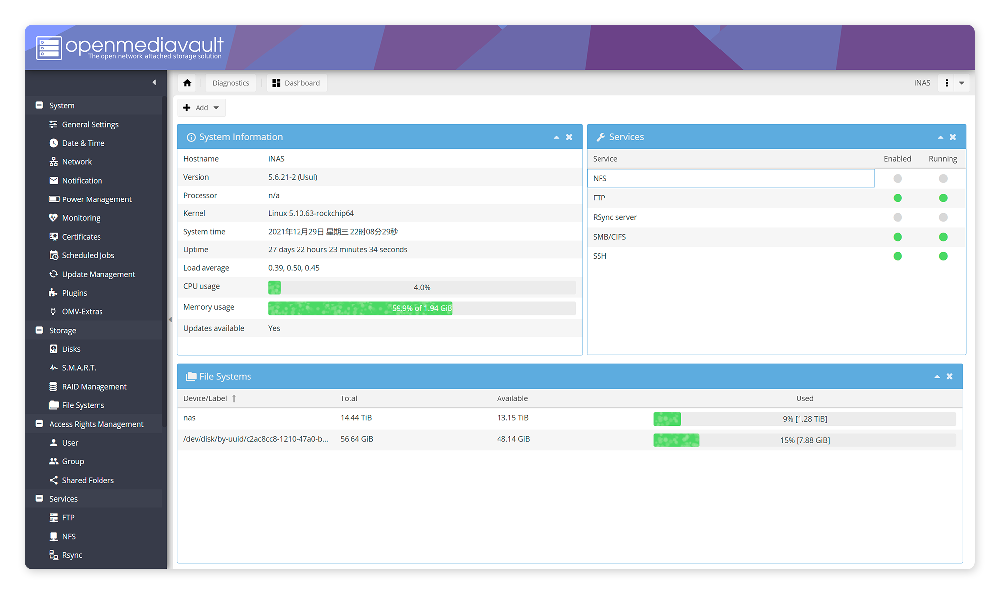

# OpenMediaVault Theme
Beautiful Theme For OpenMediaVault 5.x

<br/>

## Installation


Upload "[theme-custom.css](https://raw.githubusercontent.com/VMatrices/openmediavault-theme/main/theme-custom.css)" to following path:
```
/var/www/openmediavault/css/
```

Change the owner to `openmediavault-webgui`:
```
$ chown openmediavault-webgui:openmediavault-webgui theme-custom.css
```
Refresh page and enjoy it!

<br/>

## Build

```shell
$ cd /var/www/openmediavault/css
$ wget https://raw.githubusercontent.com/VMatrices/openmediavault-theme/main/theme-custom.scss
$ sassc -t compressed theme-custom.scss theme-custom.*
$ chown openmediavault-webgui:openmediavault-webgui theme-custom.css
```

<br/>

## Preview

<br/>

#### Login:


<br/>

#### Dashboard:



<br/>

#### SMART:


<br/>

#### Phone:


